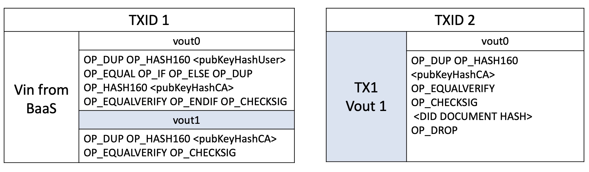
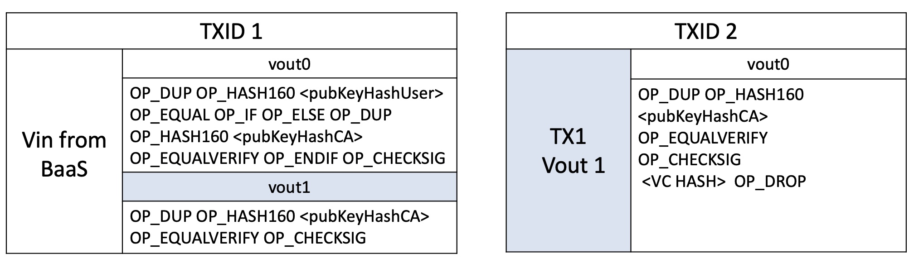

# DotID

This is the introduction to DotID protocol, which is a decentralized identifier implementation based on blockchain that complies with W3C standards. It’s designed to meet the requirement of information independent storage, identifier distributed  generation, identifier distributed management, user privacy anti-leakage and behavior traceability. According to the DotID scheme, a user can generate any number of DID identities and corresponding verifiable credentials (VC). The system fulfills the requirement of issuance, revocation and verification for DID and VC. 

### Usage Warning

**This is a Beta release under drafting process. We are very welcome developer to join this discussion to improve DotID.**


## DotID Format aka DID

    did:dotid:<TXID>

## DotID & DotID Document Example

```json
{        
 "did_document": 
    {
        "@context":"https://www.w3.org/ns/did/v1",
        "subject":"example_subject",
        "id":" did:dotid: <TXID>",//user's did
        "authentication":{
                "type":"dotwalletVerificationKey2020",
                "controller":"did:dotid:<TXID>",//issuer's did
                "publicKey":" example_pubkey"
               }
    }
}

```
## Verifiable Credentials Example

```json
{
    "vc": 
        { 
            "@context":"https://www.w3.org/2018/credentials/v1", 
            "type":["example_type"], 
            "issuer":"did:dotid:<TXID>",// issuer’s did
            "generated_txid":"<TXID>",
            "issuanceDate":"2020-01-01T19:73:24Z", 
            "expirationDate":"2021-01-01T19:23:24Z", 
            "credentialSubject":
                { 
                    "example_member_card":
                        { 
                            "holder":"did:dotid:<TXID>",//user’s did
                            "useage":"30% discount" 
                        } 
                }, 
            "proof":{ 
                "type":"example_ECDH", 
                "created":"2020-01-01T19:73:24Z", 
                "proofPurpose":"verify_example_member_card", 
                "verificationMethod":"did:dotid:txid",//issuer’s did
                "signature":"example_sig" 
                } 
        } 
}


```

## DotID & Verifiable Credentials Issuance

We combine CA and BaaS as our service provider, which will upload the intended information into the blockchain, all the information we need will be kept in user & blockchian's UTXO structure.

## DotID & Verifiable Credentials Stored UTXO Structure
### DotID Structure


### VC Structure


## DotID & VC Revoke

If CA or user would like to revoke a DID/VC, they only need to spend vout0 on TX1.

## DotID & VC Validation

User only needs to submit TXID2 & DID Document/VC to the verifier, the verifier can use public key and signature obtained from blockchian to validate it.

## Use Case

### Combine DotID With Telphone Number

#### Applied Scene

By binding DotID identity to the user's mobile phone and public key, service provider can make sure that the telephone number and public key's relationship. It can work as a identifier replacement that service provide can utilize telephone as public key to achieve transfer cryptocurrency by telephone or peer-to-peer communication through public key.

#### Generate user's DotID

BaaS and CA will generate DotID to a particular user.

#### Generate Telephone-PublicKey VC

BaaS and CA will geenrate Telephone-PublicKey VC to a particular user

#### Validate VC/DotID

Verifier can use TXID2 and DotID Document/VC submitted by user to obtain information from blockchain, which can help us to validate the correctness of the information

#### Revoke VC/DotID

User/CA only need to spend first vout of TX1

#### Much more details and information are described in DotID white paper.

